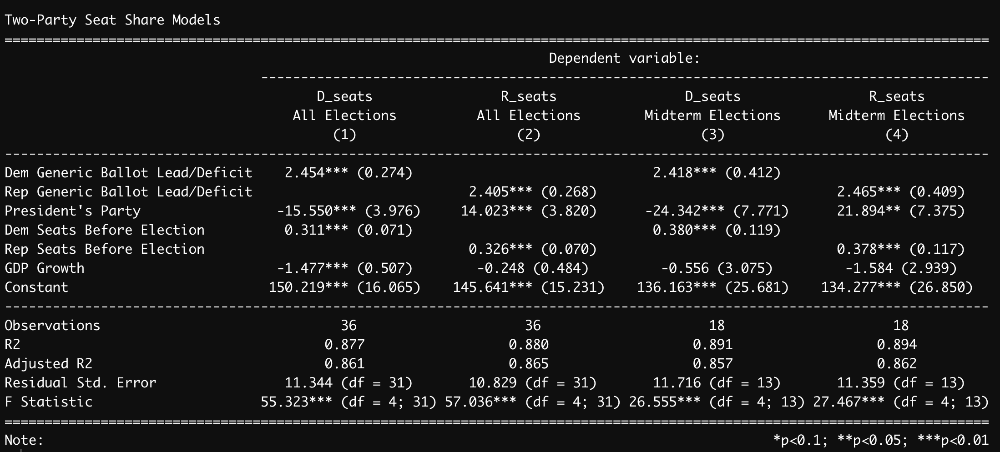

*This blog is part of a series related to Gov 1347: Election Analytics, a course at Harvard University taught by Professor Ryan D. Enos.*

# Introduction

This post has been a long time coming. A culmination of all of my analytical work and experimentation with R this semester, this post will describe and evaluate my final predictive model for the 2022 Election.

For the last ten weeks, I have been building models to try to predict the election, using new dependent variables as we study them. After many different experiments and references to academic work, I chose the model that I will evaluate in this post, predicting nationwide seat share for each party.

```{r setup, echo = FALSE, message = FALSE, warning = FALSE}
knitr::opts_chunk$set(echo = FALSE, message = FALSE, warning = FALSE)

library(tidyverse)
library(dplyr)
library(ggplot2)
library(readr)
library(janitor)
library(stargazer)
library(usmap)
library(ggmap)
library(rmapshaper)
library(blogdown)
library(tinytex)
library(donnermap)
library(dotenv)
library(jsonlite)
library(tidyverse)
library(lubridate)
```

```{r generic ballot}
# read in data
hist <- read.csv("house nationwide vote and seat share by party 1948-2020.csv")
generic_df <- read.csv("GenericPolls1942_2020.csv")
generic2022 <- read.csv("538_generic_poll_2022.csv")

# create year in 2022 data set
generic2022 <- generic2022 %>% 
  mutate(year = "2022")

# sort for results after Sept 1
generic2022$enddate <- as.Date(generic2022$enddate, format = "%m/%d/%y")
   
electionday <- as.Date("2022-11-08")
generic2022 <- generic2022 %>%    
  mutate(days_until_election = electionday - enddate) 

generic2022$days_until_election <- gsub(" days", "", generic2022$days_until_election)

generic2022$days_until_election <- as.numeric(generic2022$days_until_election)

generic2022recent <- generic2022 %>% 
  filter(days_until_election <= 68)

# sort other generic ballot by days until election
generic_df$year <- as.numeric(generic_df$year)
generic <- generic_df %>% 
  filter(days_until_election <= 68) %>% 
  filter(days_until_election >= 0) 

# find mean percentages per year
generic2022recent <- generic2022recent %>% 
  group_by(year) %>% 
  mutate(mean_dem = mean(adjusted_dem)) %>% 
  mutate(mean_rep = mean(adjusted_rep))

generic2022avg <- generic2022recent %>% 
  filter(days_until_election == 67) %>% 
  select("year", "mean_dem", "mean_rep")
  
generic <- generic %>% 
  group_by(year) %>% 
  mutate(mean_dem = mean(dem)) %>% 
  mutate(mean_rep = mean(rep))

generic <- generic %>% 
  select("year", "mean_dem", "mean_rep") %>% 
  unique()

generic2022avg$year <- as.numeric(generic2022avg$year)

# join two generic ballot data sets
generic <- generic %>% full_join(generic2022avg)
```

```{r history}
hist <- hist %>% 
  select("year", "R_votes", "D_votes", "R_seats", "D_seats", "R_majorvote_pct", "D_majorvote_pct", "winner_party") %>% 
  mutate(D_seats_before = lag(D_seats)) %>% 
  mutate(R_seats_before = lag(R_seats))

hist2022 <- data.frame("year" = 2022,
                       "R_votes" = NA, 
                       "D_votes" = NA, 
                       "R_seats" = NA, 
                       "D_seats" = NA, 
                       "R_majorvote_pct" = NA, 
                       "D_majorvote_pct" = NA, 
                       "winner_party" = NA,
                       "D_seats_before" = 220,
                       "R_seats_before" = 212)

hist <- rbind(hist, hist2022)

hist <- hist %>% 
  left_join(generic, by = "year")

hist <- hist %>% 
  mutate(presparty = case_when(
         year == 1950 ~ "1",
         year == 1952 ~ "1",
         year == 1954 ~ "0",
         year == 1956 ~ "0",
         year == 1958 ~ "0",
         year == 1960 ~ "0",
         year == 1962 ~ "1",
         year == 1964 ~ "1",
         year == 1966 ~ "1",
         year == 1968 ~ "1",
         year == 1970 ~ "0",
         year == 1972 ~ "0",
         year == 1974 ~ "0",
         year == 1976 ~ "0",
         year == 1978 ~ "1",
         year == 1980 ~ "1",
         year == 1982 ~ "0",
         year == 1984 ~ "0",
         year == 1986 ~ "0",
         year == 1988 ~ "0",
         year == 1990 ~ "0",
         year == 1992 ~ "0",
         year == 1994 ~ "1",
         year == 1996 ~ "1",
         year == 1998 ~ "1",
         year == 2000 ~ "1",
         year == 2002 ~ "0",
         year == 2004 ~ "0",
         year == 2006 ~ "0",
         year == 2008 ~ "0",
         year == 2010 ~ "1",
         year == 2012 ~ "1",
         year == 2014 ~ "1",
         year == 2016 ~ "1",
         year == 2018 ~ "0",
         year == 2020 ~ "0",
         year == 2022 ~ "1")) 

hist$D_votes <- as.numeric(gsub(",","",hist$D_votes))

data <- hist %>% 
  rename("demballot" = "mean_dem") %>% 
  rename("repballot" = "mean_rep") %>% 
  mutate(demballotdif = demballot-repballot) %>% 
  mutate(repballotdif = repballot-demballot) %>% 
  filter(year != 1948)

# add gdp to dataset
gdp <- read.csv("GDP_quarterly_2022_good.csv")
gdp <- gdp %>% 
  filter(quarter_cycle == 7) %>% 
  select("year", "GDP_growth_pct")
data <- data %>% 
  left_join(gdp, by = "year")

# filter into midterm and all year datasets

data_midterm <- data %>% 
  filter(year != 1944) %>% 
  filter(year != 1948) %>% 
  filter(year != 1952) %>% 
  filter(year != 1956) %>% 
  filter(year != 1960) %>% 
  filter(year != 1964) %>%
  filter(year != 1968) %>%
  filter(year != 1972) %>%
  filter(year != 1976) %>%
  filter(year != 1980) %>%
  filter(year != 1984) %>%
  filter(year != 1988) %>%
  filter(year != 1992) %>%
  filter(year != 1996) %>%
  filter(year != 2000) %>%
  filter(year != 2004) %>%
  filter(year != 2008) %>%
  filter(year != 2012) %>%
  filter(year != 2016) %>%
  filter(year != 2020)

# add cvap to data set
# cvap <- read.csv("nationwide-cvap.csv")
# dataglm <- data %>% 
#  inner_join(cvap, by = "year") %>% 
#  rename("cvap" = "est_cvap")
```

# Model Justification and Formula

After seeing how many different datasets and variables interact in a model, my final bit of inspiration came rather recently. In class last week, we read a series of articles about forecasting the 2018 midterms, evaluating their skill in presenting information to their reader. One of the articles, by Alan I. Abramowitz, described a model with very high statistical significance that predicted solely on three dependent variables: the number of seats a party held before the election, whether the president's party was Democrat or Republican, and the generic ballot lead or deficit of the party.

I have been having some trouble throughout the semester with my models becoming overly complicated with too many variables and not enough data, so I used similar variables in my model, adding in GDP and mimicking Abramowitz's formula for both parties, not just Republicans like he did in 2018. 

In order to create a dataset to fit these needs, I started with historical data of nationwide vote and seat share. I also used a dataset of generic ballot results, I then filtered that data down to only polls after September 1st in order to get results closer to the election. I joined the historical data and the generic ballot data, and created variables for the generic ballot differences. Finally, I joined in GDP data and created two sets of data, one of all election years and one of only midterm election years.

I decided to use a simple linear model. I felt that the purpose of this week's exercise was presentation and more complex models are much harder to understand on a widespread basis. Linear models convey information more simply and require fewer mathematical tricks to get to relatively similar results. 

My model formula to find the seat share looked like the following, and I swapped out the party and dataset accordingly, ending up with two different types of model and one set for each party.

lm(PARTY_seats ~  PARTYballotdif + presparty + PARTY_seats_before + GDP_growth_pct, data = ELECTIONdata)

```{r glm model}
# make glm
# train_glm <- dataglm %>% 
#   filter(year != 2022)

# test_glm <- dataglm %>% 
#   filter(year == 2022)

# train_modelglm <- glm(cbind(D_votes, cvap-D_votes) ~  demballotdif + presparty + D_seats_before, data = train_glm, family = binomial)

# train_modelglm

# Predicting 2022
# pred_2022_glm <- predict(train_modelglm, newdata = test_glm, type = "response")[[1]]
# lowerglm <- predict(train_modelglm, newdata = test_glm, type = "response")[[2]]
# upperglm <- predict(train_modelglm, newdata = test_glm, type = "response")[[3]]

# r-squared is the mcfadden r-squared which requires a special formula

# mcf_rsquared <- (1 - train_modelglm$deviance) / train_modelglm$null.deviance
# mcf_rsquared 
```

# Coefficients

```{r lm model - seat share}
# make lm - all years
train_lm <- data %>% 
  filter(year != 2022)

test_lm <- data %>% 
  filter(year == 2022)

train_modeldemlm <- lm(D_seats ~  demballotdif + presparty + D_seats_before + GDP_growth_pct, data = train_lm)
train_modelreplm <- lm(R_seats ~  repballotdif + presparty + R_seats_before + GDP_growth_pct, data = train_lm)

# make lm - midterm years
train_lm_midterm <- data_midterm %>% 
  filter(year != 2022)

test_lm_midterm <- data_midterm %>% 
  filter(year == 2022)

train_modeldemlm_midterm <- lm(D_seats ~  demballotdif + presparty + D_seats_before + GDP_growth_pct, data = train_lm_midterm)
train_modelreplm_midterm <- lm(R_seats ~  repballotdif + presparty + R_seats_before + GDP_growth_pct, data = train_lm_midterm)

# Stargazer

# stargazer(train_modeldemlm, train_modelreplm, train_modeldemlm_midterm, train_modelreplm_midterm, header=FALSE, type='text', no.space = TRUE, column.sep.width = "3pt", font.size = "scriptsize", single.row = TRUE, title = "Two-Party Seat Share Models",
#          covariate.labels = c("Dem Generic Ballot Lead/Deficit", "Rep Generic Ballot Lead/Deficit", "President's Party", "Dem Seats Before Election", "Rep Seats Before Election", "GDP Growth"), column.labels = c("All Elections", "All Elections", "Midterm Elections", "Midterm Elections"))

# Predicting 2022 - based on all years
pred_2022_demlm <- predict(train_modeldemlm, newdata = test_lm, interval = "prediction")
pred_2022_replm <- predict(train_modelreplm, newdata = test_lm, interval = "prediction")

# print(pred_2022_demlm)
# print(pred_2022_replm)

# Predicting 2022 - based on midterm years
pred_2022_demlm_mid <- predict(train_modeldemlm_midterm, newdata = test_lm_midterm, interval = "prediction")
pred_2022_replm_mid <- predict(train_modelreplm_midterm, newdata = test_lm_midterm, interval = "prediction")

# print(pred_2022_demlm_mid)
# print(pred_2022_replm_mid)

# lowerlm <- predict(train_model, newdata = test_1, type = "response")[[2]]
# upperlm <- predict(train_model, newdata = test_1, type = "response")[[3]]

```


These are quite promising results. Every variable is statistically significant at the 5% significance level except for GDP, and both the generic ballot and number of seats held before the election are significant at the 1% level. The adjusted r-squareds are all strong in the mid 80s, at .861 for Democrats and .865 for Republicans when we look at the data for all elections. 

When interpreting the coefficients, both generic ballot lead/deficit and seats before the election seem to change at similar rates for both parties. For every additional point lead in the generic ballot, the corresponding party is projected to gain about two and half seats in congress. For every additional seat held before the election, the party is projected to gain about a third of a seat. 

The coefficient of president's party reflects the concept of incumbent presidents' parties being punished, particularly during midterms. In coding the variable, I designated +1 to Democratic presidents and 0 to Republican presidents. This conveys through the coefficients that if the president is a Democrat, the party is expected to lose 15 seats. In midterm years, this is exacerbated to 24 seats.

Finally, GDP growth is a bit wild. First, the only statistically significant coefficient for GDP is for Democrats in all election years. It indicates that for every additional percentage point of GDP growth, the Democrats lose 1.5 seats in the House. This doesn't necessarily make sense given the literature that we have read and the results of my model earlier this semester that was solely based on GDP. Given the statistical insignificance of the other GDP coefficients, this variable should not be considered helpful.

# Model Validation

## In-Sample Fit

To evaluate my model, there are two types of testing we can conduct, in-sample fit and out-of-sample fit. In-sample fit uses the data we already have by looking at the r-squareds and comparing the in-sample error, defined as how often a prediction on historical data matches the actual historical result. I examined the r-squareds of my model and found that they are relatively strong, ranging around .86. To compare the in-sample error, I graphed historical results versus predictions for each model.

```{r}
par(mfrow=c(2,2))
plot(data$year, data$D_seats, 
     type = "l",
     col = "blue",
     main = "Democrat Based on All Elections",
     xlab = "Year",
     ylab = "Seat Share",
     sub = "True Y (line), Predicted Y (dot)")
points(data$year, predict(train_modeldemlm, data))

plot(data$year, data$R_seats, 
     type = "l",
     col = "red",
     main = "Republican Based on All Elections",
     xlab = "Year",
     ylab = "Seat Share",
     sub = "True Y (line), Predicted Y (dot)")
points(data$year, predict(train_modelreplm, data))

plot(data_midterm$year, data_midterm$D_seats, 
     type = "l",
     col = "blue",
     main = "Democrat Based on Midterms",
     xlab = "Year",
     ylab = "Seat Share",
     sub = "True Y (line), Predicted Y (dot)")
points(data_midterm$year, predict(train_modeldemlm_midterm, data_midterm))

plot(data_midterm$year, data_midterm$R_seats, 
     type = "l",
     col = "red",
     main = "Republican Based on Midterms",
     xlab = "Year",
     ylab = "Seat Share",
     sub = "True Y (line), Predicted Y (dot)")
points(data_midterm$year, predict(train_modelreplm_midterm, data_midterm))

# Mean Squared Error
mse_g_demlm <- mean((train_modeldemlm$model$D_seats - 
                 train_modeldemlm$fitted.values)^2)
sqrt(mse_g_demlm)

mse_g_replm <- mean((train_modelreplm$model$R_seats - 
                 train_modelreplm$fitted.values)^2)
sqrt(mse_g_replm)

mse_g_demlm_mid <- mean((train_modeldemlm_midterm$model$D_seats - 
                 train_modeldemlm_midterm$fitted.values)^2)
sqrt(mse_g_demlm_mid)

mse_g_replm_mid <- mean((train_modelreplm_midterm$model$R_seats - 
                 train_modelreplm_midterm$fitted.values)^2)
sqrt(mse_g_replm_mid)
```
Based on the in-sample error graphs, the models containing on more data points, i.e. all of the elections instead of just midterms, seem to hit more historical data points and are more trustworthy. Afterwards, I calculated the mean squared error, a numerical summary of the difference between historical data and prediction, for each model. They all ended up around 10, so the models should be relatively comparable.

## Out-of-Sample Fit

Out-of-sample fit tests are very similar to in-sample fit tests except that we withhold one historical observation from the data set in order to try to predict its result. 

```{r}
# all D
outsamp_mod1 <- lm(D_seats ~  demballotdif + presparty + D_seats_before + GDP_growth_pct, 
                    train_lm[train_lm$year != 2018,])
outsamp_pred1 <- predict(outsamp_mod1, 
                        train_lm[train_lm$year == 2018,])
outsamp_true1 <- train_lm$D_seats[train_lm$year == 2018] 
outsamp_pred1 - outsamp_true1

# all R
outsamp_mod2 <- lm(R_seats ~  demballotdif + presparty + D_seats_before + GDP_growth_pct, 
                    train_lm[train_lm$year != 2018,])
outsamp_pred2 <- predict(outsamp_mod2, 
                        train_lm[train_lm$year == 2018,])
outsamp_true2 <- train_lm$R_seats[train_lm$year == 2018] 
outsamp_pred2 - outsamp_true2
# mid D
outsamp_mod3 <- lm(D_seats ~  demballotdif + presparty + D_seats_before + GDP_growth_pct, 
                    train_lm_midterm[train_lm_midterm$year != 2018,])
outsamp_pred3 <- predict(outsamp_mod3, 
                        train_lm_midterm[train_lm_midterm$year == 2018,])
outsamp_true3 <- train_lm_midterm$D_seats[train_lm_midterm$year == 2018] 
outsamp_pred3 - outsamp_true3
# mid R
outsamp_mod4 <- lm(R_seats ~  demballotdif + presparty + D_seats_before + GDP_growth_pct, 
                    train_lm_midterm[train_lm_midterm$year != 2018,])
outsamp_pred4 <- predict(outsamp_mod4, 
                        train_lm_midterm[train_lm_midterm$year == 2018,])
outsamp_true4 <- train_lm_midterm$R_seats[train_lm_midterm$year == 2018] 
outsamp_pred4 - outsamp_true4
```
The numbers above represent the predicted value minus the true value for each model. This out-of-sample testing reveals that, for Democrats, the models underpredict the results, making the true value larger than the predicted value and yielding the negative numbers. For Republicans, the models overpredict the results in the opposite phenomenon. This is something to consider when it comes time to decide which model to choose for my final prediction because if I have a choice, the model with closer, less dramatic differences might be more correct.

# Prediction Intervals and Uncertainty

```{r}
interval <- data.frame("Model" = character(),    # Create empty data frame
                    "Fit" = numeric(),
                    "lwr" = numeric(),
                    "upr" = numeric(),
                    stringsAsFactors = FALSE)

interval[1, ] <- list("Dem All Elections", pred_2022_demlm[1,1], pred_2022_demlm[1,2], pred_2022_demlm[1,3])
interval[2, ] <- list("Rep All Elections", pred_2022_replm[1,1], pred_2022_replm[1,2], pred_2022_replm[1,3])
interval[3, ] <- list("Dem Midterms", pred_2022_demlm_mid[1,1], pred_2022_demlm_mid[1,2], pred_2022_demlm_mid[1,3])
interval[4, ] <- list("Rep Midterms", pred_2022_replm_mid[1,1], pred_2022_replm_mid[1,2], pred_2022_replm_mid[1,3])

interval$lwr <- as.numeric(interval$lwr)
interval$Fit <- as.numeric(interval$Fit)
interval$upr <- as.numeric(interval$upr)

print(interval)

ggplot(data = interval, aes(x = Model, y = Fit, col = Model)) + 
  geom_point() + 
  geom_errorbar(aes(ymin = lwr, ymax = upr)) + 
  labs(title = "Predicted Seat Share for 2022", subtitle = "Error bars represent 95% confidence interval, dashed line is at split seat share") + 
  scale_color_manual(values = c("Blue","Blue","Red","Red")) +
  geom_hline(yintercept = 217, linetype = 'dashed')
```
This graph depicts the fit, lower and upper bounds of each model's prediction as shown in the table immediately before. These are relatively wide intervals of prediction. As a result, no matter the accuracy of the model, there is still enough overlap of the Democratic and Republican intervals that the party holding a majority of seats could flip.

# Final Prediction and Conclusion

Based on all of the investigations I have just completed regarding the accuracy of my models, I have decided to use the models based on all of the historical election data, not just midterms. Not only does that model have a smaller interval of prediction but it performed better on the out-of-sample fit test. While the adjusted r-squareds were also higher, it was by such a small amount (0.003) that it seems insignificant. They also had marginally smaller residual standard errors. Overall, I believe that the predictions that have more training data are more reliable. 

Because I used separate models for Democrats and Republicans, their predicted seat totals do not add up to 435. In order to reach that number for our class predictions, I will rely on the Republican models and calculate Democratic seat share using simple subtraction, leading to *a result of 210 seats for the Democrats and 225  seats for the Republicans.* When using the fitted values from both my Republican and Democrat models, however, I predict that *the Democratic party will win 205 seats and the Republican party will win 225 seats in the 2022 midterms.* 

Just because my final predictions are in doesn't mean that this is my last blog post. I'll be back for a reflection on the election results and the quality of my model soon!